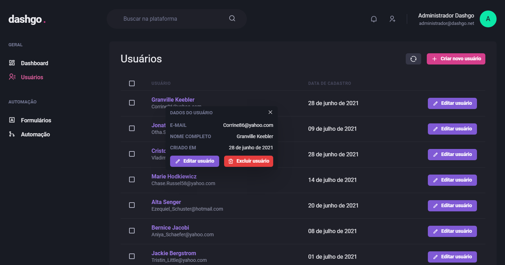

<h1 align="center">
	Dashgo
</h1>

<h1 align="center">
  
</h1>

### 🚀 Technologies

- [ReactJS](https://reactjs.org/)
- [TypeScript](https://www.typescriptlang.org/)
- [Chakra UI](https://chakra-ui.com/)
- [Next.js](https://nextjs.org/)
- [React Hook Form](https://react-hook-form.com/)
- [React Query](https://react-query.tanstack.com/)
- [Mirage JS](https://miragejs.com/)

<br/>

### 💻 Sobre o projeto

🧭 Dashgo é um dashboard fictício construído para aplicar conhecimentos de chakra-ui, react hook form e react query para cache de dados.

<br/>

### ⚙️ Funcionalidades

- [x] Cadastrar usuários
- [x] Listagem de usuários
- [x] Paginação dos resultados

<br/>

### 🚀 Como executar o projeto

Antes de começar, você vai precisar ter instalado em sua máquina as seguintes ferramentas:
[Git](https://git-scm.com), [Node.js](https://nodejs.org/en/).
Além disto é bom ter um editor para trabalhar com o código como [VSCode](https://code.visualstudio.com/)

#### 🧭 Rodando a aplicação

```bash

# Clone este repositório
$ git clone https://github.com/brunowbbs/dashgo.git

# Acesse a pasta do projeto no seu terminal/cmd
$ cd dashgo

# Instale as dependências
$ yarn install # ou npm install

# Execute a aplicação em modo de desenvolvimento
$ yarn dev # ou npm run dev

# A aplicação será aberta na porta:3000 - acesse http://localhost:3000

```

### 🦸 Autor

<a href="https://https://app.rocketseat.com.br/me/wesley-bruno-barbosa-silva-04826">
 
 <br />
 <sub><b>Wesley Bruno</b></sub></a> <a href="https://https://app.rocketseat.com.br/me/wesley-bruno-barbosa-silva-04826" title="Rocketseat">🚀</a>
 <br />

[](https://www.linkedin.com/in/brunowbbs/)
[](mailto:engwesleybruno@gmail.com)

---

Feito por Wesley Bruno.
